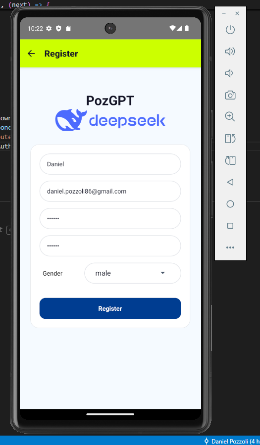
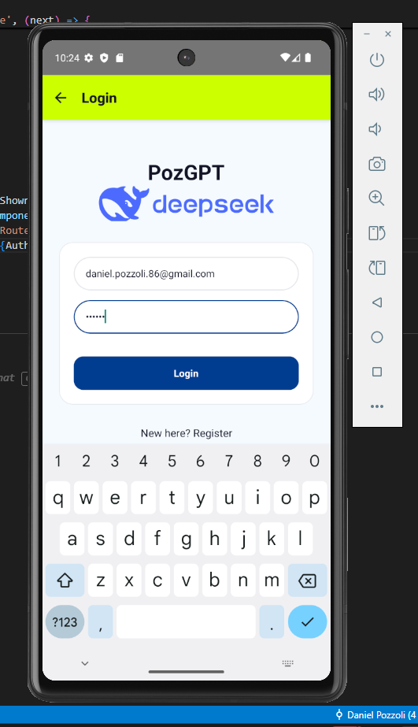

# MyAiChat(PozGPT) 🤖  
**An AI Chat App powered by DeepSeek Engine**  
Developed by **Daniel Pozzoli**

---

## 📑Table of Contents
- [📑Table of Contents](#table-of-contents)
- [🧭Overview](#overview)
- [✨Main Features](#main-features)
- [🧠AI Integration](#ai-integration)
- [🛠️Technologies Used](#️technologies-used)
- [⚙️Installation Guide](#️installation-guide)
  - [📱Option 1 — Install from APK](#option-1--install-from-apk)
  - [💻Option 2 — Run from Source](#option-2--run-from-source)
- [🧩Backend Setup](#backend-setup)
- [🔥Firebase Configuration](#firebase-configuration)
- [👨‍💻Developer](#developer)
- [🌐Repository](#repository)
- [📸Screenshots](#screenshots)
- [📜License](#license)

---

## 🧭Overview  
PozGPT is a cross-platform mobile chat application built with **React Native**.  
It allows users to register, log in, and chat with an AI model powered by the **DeepSeek API** through a custom backend deployed on **Render**.  
The app includes authentication with **Firebase**, dark mode, a custom sidebar navigation, and chat persistence.

The final APK release is available in the repository for direct installation and testing.

Chats are sent to a third-party AI via our hosted backend; only profile fields (name, gender, email) are stored in Firestore—no chat PII is persisted.

For quick testing you can register any email in the format `x@y.z` (fake emails work), or use test@test.test / 123456

---

## ✨Main Features  
- Splash and welcome screen with animated branding  
- User registration and authentication using **Firebase**  
- Profile creation stored in **Firestore** (name, gender, email)  
- Drawer navigation with a personalized greeting  
- AI Chat screen with conversation bubbles and “New Chat” button  
- Chat saving and highlighting of the active conversation  
- UI Settings with dark mode toggle  
- Account settings for changing password and email  
- Logout function  
- Backend hosted on **Render** to handle communication with the DeepSeek API  

---

## 🧠AI Integration  
PozGPT communicates with the **DeepSeek engine** through a Node.js backend.  
All user messages are sent securely to the backend, which processes the request and returns the AI’s response.

---

## 🛠️Technologies Used  
- **React Native (CLI)**  
- **Firebase Authentication & Firestore**  
- **Node.js (Render backend)**  
- **DeepSeek API**  
- **React Navigation (Drawer + Stack)**  
- **AsyncStorage**  
- **Styled Components**  

---

## ⚙️Installation Guide  

### 📱Option 1 — Install from APK  
1. Download the latest `PozGPT-release.apk` file from this repository’s **Releases** section or root folder.  
2. Transfer it to your Android device (via USB, email, or cloud).  
3. Enable **Install from unknown sources** in your Android settings.  
4. Open the file and install the app.  
5. Launch **PozGPT** from your app drawer and start chatting! On first launch, the AI chat may take a few seconds to respond while the Render service wakes up.

---

### 💻Option 2 — Run from Source  
If you want to run or modify the project on your computer:

#### 🔐Test account (quick start)
If you want to try the app immediately, either register a new account (any email that looks like `x@y.z` is accepted) or sign in with the test account:

**Email:** `test@test.test`  
**Password:** `123456`

Note: the test account is provided for convenience. The test user cannot be modified or deleted from the app.

#### 🧩Prerequisites  
- Node.js (v16 or newer)  
- React Native CLI  
- Android Studio (or emulator setup)  
- Firebase project and credentials  

#### 🚀Steps  
```bash
# Clone the repository
git clone https://github.com/yourusername/PozGPT.git

# Navigate into the folder
cd PozGPT

# Install dependencies
npm install

# Run on Android emulator or device
npx react-native run-android
```

No local backend is needed as long as `API_BASE_URL` points to the Render service. If you run a local server, update `API_BASE_URL` accordingly. 

---

## 🧩Backend Setup
1. Clone the backend folder (included in `/server`).
2. Install dependencies:
   
    ```bash
    npm install
    ```
3. Create a `.env` file with your DeepSeek API key and Firebase config.
4. Deploy on **Render** or any Node-compatible hosting service.

The app is preconfigured to use the hosted backend on Render via `API_BASE_URL`. **No local server is required** to run the APK or the source. To self-host, deploy the backend in `/server` and set `API_BASE_URL` to your service URL. Note: free Render plans may cold-start, so the first request can take a few seconds.
   
---   

## 🔥Firebase Configuration
Ensure that your Firebase project includes:
- **Authentication** enabled (Email/Password).
- **Firestore Database** with read/write access for authenticated users.

---

## 👨‍💻Developer
**Daniel Pozzoli**

BIT Student

---

## 🌐Repository
[https://github.com/Danypoz1986/MyAiChat-PozGpt-](https://github.com/Danypoz1986/MyAiChat-PozGpt-)

The repository includes:
- Complete React Native source code
- Backend server code
- `PozGPT-release.apk` ready to install

---

## 📸Screenshots

| Register | Register Success | Login |
|-------|------|-----------|
|  |  |  |

| AI Chat | Sidebar Menu | Dark Mode |
|-----------|---------|---------------|   
|  |  |  |

---

## 📜License
This project is released under the **MIT License**.
You are free to clone, modify, and test the app for educational and non-commercial purposes.